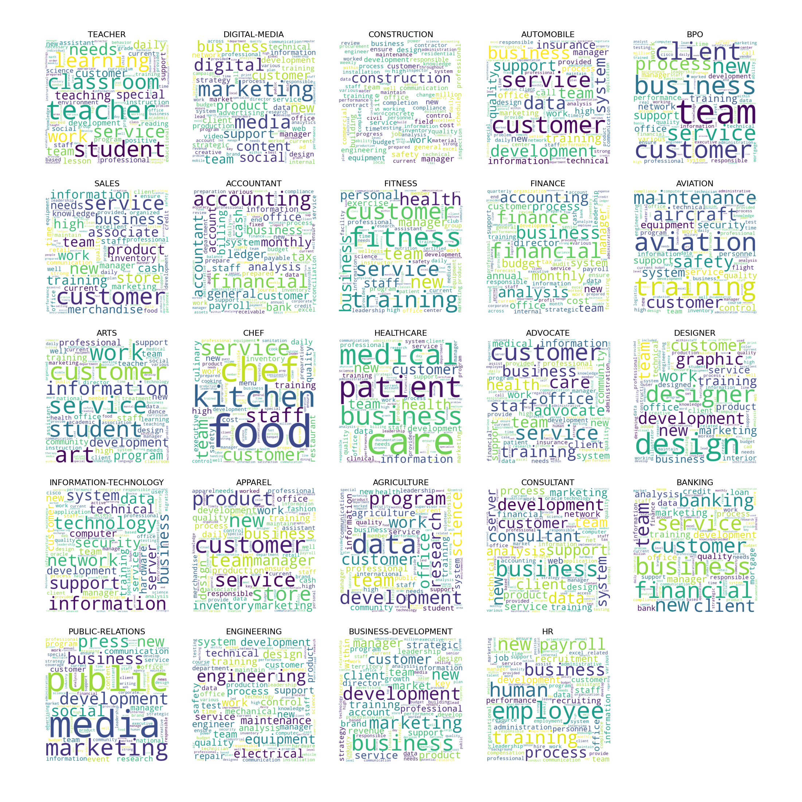
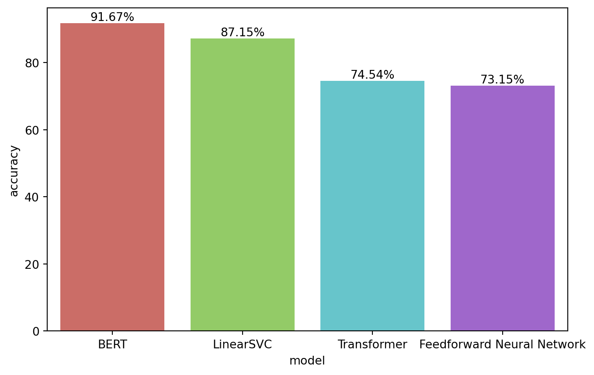

[logo]

# TITLE
### SUBTITLE

![Gensim](https://img.shields.io/badge/gensim-white?logo=data%3Aimage%2Fsvg%2Bxml%3Bbase64%2CPD94bWwgdmVyc2lvbj0iMS4wIiBzdGFuZGFsb25lPSJubyI%2FPgo8IURPQ1RZUEUgc3ZnIFBVQkxJQyAiLS8vVzNDLy9EVEQgU1ZHIDIwMDEwOTA0Ly9FTiIKICJodHRwOi8vd3d3LnczLm9yZy9UUi8yMDAxL1JFQy1TVkctMjAwMTA5MDQvRFREL3N2ZzEwLmR0ZCI%2BCjxzdmcgdmVyc2lvbj0iMS4wIiB4bWxucz0iaHR0cDovL3d3dy53My5vcmcvMjAwMC9zdmciCiB3aWR0aD0iMjAwLjAwMDAwMHB0IiBoZWlnaHQ9IjIwMC4wMDAwMDBwdCIgdmlld0JveD0iMCAwIDIwMC4wMDAwMDAgMjAwLjAwMDAwMCIKIHByZXNlcnZlQXNwZWN0UmF0aW89InhNaWRZTWlkIG1lZXQiPgoKPGcgdHJhbnNmb3JtPSJ0cmFuc2xhdGUoMC4wMDAwMDAsMjAwLjAwMDAwMCkgc2NhbGUoMC4xMDAwMDAsLTAuMTAwMDAwKSIKZmlsbD0iIzAwMDAwMCIgc3Ryb2tlPSJub25lIj4KPHBhdGggZD0iTTg3MCAxOTkwIGMtNDA4IC01NyAtNzMzIC0zNDggLTgzNyAtNzQ5IC0zMSAtMTE4IC0zNSAtMzIyIC0xMCAtNDM2CjU0IC0yNDMgMTg3IC00NTMgMzc3IC01OTcgODQgLTY0IDI0MyAtMTQyIDM0NSAtMTcwIDY4IC0xOSAxMDYgLTIyIDI1NSAtMjIKMjAwIDAgMjY2IDEzIDQxNCA4MiAxMTUgNTQgMTk4IDExMiAyODcgMjAxIDEyNCAxMjUgMjE2IDI4MiAyNjAgNDQ2IDMzIDEyMgozOCAzNTAgMTAgNDY3IC00OSAyMDUgLTEzOCAzNjUgLTI4MiA1MDMgLTEzOSAxMzIgLTI3MCAyMDYgLTQ0NiAyNTEgLTEwOCAyNwotMjczIDM4IC0zNzMgMjR6IG0zNzUgLTYxIGMyOTcgLTc1IDU2MCAtMzIwIDY2MSAtNjE2IDU5IC0xNzQgNjIgLTI4MCAxMgotNDMzIC03MiAtMjIyIC0yNDIgLTQxMSAtNDU1IC01MDUgLTE0OSAtNjcgLTM2OSAtODUgLTUyOSAtNDUgLTkzIDIzIC0yNzEKMTA3IC0yNTcgMTIxIDYgNiAyNSAzIDQ5IC03IDUxIC0yMSAxODYgLTMwIDI1MyAtMTUgMTU3IDM0IDI4NyAxNTAgMzQxIDMwNgoyOCA4MSAyNyAyMTQgLTEgMjk3IC03MyAyMTYgLTI5MCAzNDggLTUxMSAzMTAgLTE1NSAtMjcgLTI3NCAtMTE2IC0zNDQgLTI1OAotMzUgLTcwIC0zOSAtODYgLTQyIC0xNzQgLTMgLTcyIDAgLTExMyAxMyAtMTU2IDIwIC02OCAyMCAtNjcgNyAtNzIgLTE1IC01Ci04OSAxNTUgLTExMyAyNDMgLTMwIDExMiAtMzAgMjk3IDAgNDEwIDg0IDMxNSAzMjQgNTQ0IDY0MSA2MTEgNzggMTYgMTY1IDExCjI3NSAtMTd6Ii8%2BCjwvZz4KPC9zdmc%2BCg%3D%3D)
![NLTK](https://img.shields.io/badge/nltk-white?logo=data%3Aimage%2Fsvg%2Bxml%3Bbase64%2CPD94bWwgdmVyc2lvbj0iMS4wIiBzdGFuZGFsb25lPSJubyI%2FPgo8IURPQ1RZUEUgc3ZnIFBVQkxJQyAiLS8vVzNDLy9EVEQgU1ZHIDIwMDEwOTA0Ly9FTiIKICJodHRwOi8vd3d3LnczLm9yZy9UUi8yMDAxL1JFQy1TVkctMjAwMTA5MDQvRFREL3N2ZzEwLmR0ZCI%2BCjxzdmcgdmVyc2lvbj0iMS4wIiB4bWxucz0iaHR0cDovL3d3dy53My5vcmcvMjAwMC9zdmciCiB3aWR0aD0iMjc4LjAwMDAwMHB0IiBoZWlnaHQ9IjI3NS4wMDAwMDBwdCIgdmlld0JveD0iMCAwIDI3OC4wMDAwMDAgMjc1LjAwMDAwMCIKIHByZXNlcnZlQXNwZWN0UmF0aW89InhNaWRZTWlkIG1lZXQiPgoKPGcgdHJhbnNmb3JtPSJ0cmFuc2xhdGUoMC4wMDAwMDAsMjc1LjAwMDAwMCkgc2NhbGUoMC4xMDAwMDAsLTAuMTAwMDAwKSIKZmlsbD0iIzAwMDAwMCIgc3Ryb2tlPSJub25lIj4KPHBhdGggZD0iTTExODQgMjY0NSBjLTExMyAtMjAgLTI1OCAtNjggLTMyNCAtMTA3IC02NyAtNDEgLTcwIC01MiAtNzMgLTI3OApsLTIgLTE2NSAzNjggLTMgMzY3IC0yIDAgLTMwIDAgLTI5IC01NzIgLTMgLTU3MyAtMyAtNjMgLTI5IGMtMTE0IC01MyAtMTkyCi0xNjEgLTIzNCAtMzI5IC0yOCAtMTA5IC0yMiAtMzE2IDEyIC00MjIgODIgLTI1OSAyNjMgLTQyMiA0OTEgLTQ0MiBsNjUgLTYKMTggMTIyIGM0NiAzMjUgMTAwIDQyNyAyNjUgNDkzIDU0IDIyIDY2IDIzIDQxMSAyNCAzMDIgMSAzNjQgMyA0MTUgMTggODYgMjUKMTE2IDQ1IDE1MyAxMDYgNjggMTEzIDEwMiAyODYgMTAyIDUxNSAwIDM3MCAtNjMgNDg2IC0zMDAgNTU2IC02MyAxOCAtMTA1IDIyCi0yNjAgMjUgLTEyOCAyIC0yMTAgLTEgLTI2NiAtMTF6IG0tNDMgLTE2OSBjMTI1IC04NSA2NCAtMjgxIC04NyAtMjc4IC05MCAxCi0xNjQgODYgLTE0OSAxNzIgMTggMTA5IDE0NyAxNjcgMjM2IDEwNnoiLz4KPHBhdGggZD0iTTIxMTYgMTk4OCBjLTIgLTcgLTkgLTU5IC0xNSAtMTE1IC0zMCAtMjg2IC04MSAtMzk3IC0yMTIgLTQ2MiAtMTAwCi01MCAtMTQ0IC01NCAtNDQ5IC00OCAtNDQ4IDEwIC01MzEgLTEzIC02MDAgLTE2OCAtNTkgLTEzMiAtODUgLTMwNSAtNzcgLTUyNQo4IC0yNTMgNDcgLTM2NyAxNTAgLTQzNCAxMDMgLTY4IDIyOSAtOTYgNDM1IC05NiAxNDQgMCAyMzEgMTAgMzU3IDQyIDg2IDIxCjIzMiA4NSAyNTMgMTEwIDE4IDIyIDMxIDE0NCAzMiAyOTEgbDAgMTI3IC0zNzAgMCAtMzcwIDAgMCAzMCAwIDI5IDU4OCAzIDU4NwozIDUyIDI0IGM2NiAyOSAxNDEgMTA4IDE4MyAxOTAgOTggMTk1IDk1IDQ3OCAtNyA2ODkgLTQ1IDkxIC0xNTggMjEyIC0yNDAKMjU1IC05NyA1MSAtMjg4IDg2IC0yOTcgNTV6IG0tMzQ4IC0xMzc4IGMxMjggLTc4IDczIC0yODQgLTc2IC0yODQgLTE1NiAwCi0yMTMgMTk0IC04MiAyODEgNDMgMjkgMTEyIDMxIDE1OCAzeiIvPgo8L2c%2BCjwvc3ZnPgo%3D)

📄 **WRITE-UP**: [Project Write-Up](https://marcocamilo.com/portfolio/resume-classifier.html)
📔 **NOTEBOOK**: [Jupyter Notebook](https://github.com/marcocamilo/resume-classifier/notebooks)  

## 📌 Overview

<!-- The project explores the performance of advanced NLP models and vectorization techniques specifically for text classification using a dataset of resumes from various job categories. The algorithms tested include Linear SVC, Feedforward Neural Networks (FNN), Encoder models, and BERT, implemented using Scikit-Learn and PyTorch. The project aims to compare the performance of these algorithms on text classification and evaluate their effectiveness in analyzing resume data. -->

The project explores the performance of advanced NLP models and vectorization techniques specifically for text classification using a dataset of resumes from various job categories. The algorithms tested for text classification include:

- **LinearSVC**: optimized for linear decision boundaries, effective for high-dimensional sparse data.
- **Feedforward Neural Network (FNN)**: uses multiple layers of neurons to learn complex patterns in data for classification tasks.
- **Encoder Model**: transform input sequences into dense representations, which are then used to classify the text into categories.
- **Bidirectional Encoder Representations from Transformers (BERT)**: understands context in both directions, providing highly accurate text classification.

The project aims to compare the performance of these algorithms on text classification and evaluate their effectiveness in analyzing resume data.

## 🚀 Key Takeaways

1. **Key Factors in Model Performance**: quality of the feature representations and the ability to capture contextual information across dependencies.
2. **Model performance**
    - **BERT**: Best performing model with an accuracy of 91.67%. Showcases the effectiveness of pre-trained models and transfer learning.
    - **Linear SVC**: Achieved an accuracy of 87.15% with TF-IDF vectors. Attributed to the model’s simplicity and use of effective feature representation. 
    - **Encoder Model**: Achieved an accuracy of 74.54%. Suggests the need for further fine-tunning, give the difference with its cousin transformer model.
    - **Feedforward Neural Network**: achieved an accuracy of 73.15%, the lowest of the four models. Indicates struggle with sequential dependencies and contextual nuances.
3. **Preprocessing and Vectorization**: effective text preprocessing and robust vectorization techniques significantly enhanced overall model performance (> 70%).

[👇 Jump to results and discussion](#-results-and-discussion)

## 📂 Table of Contents

- [Overview](#-overview)
- [Key Takeaways](#-key-takeaways--project-insights)
- [Motivation](#-motivation)
- [Approach](#-approach)
- [Dataset](#-dataset)
- [Preprocessing](#-preprocessing)
- [Exploratory Data Analysis (EDA)](#-exploratory-data-analysis-eda)
- [Feature Engineering](#️-feature-engineering)
- [Model Development](#-model-development)
- [Model Performance](#-model-performance)
- [Results and Discussion](#-results-and-discussion)
- [Future Work](#-future-work)
- [References](#-references)

## 📋 Motivation

My motivation behind this project is to study various machine learning and vectorization algorithms in modeling and classifying text data. Professionally, this project will enhance my ability to design robust solutions for organizations that require effective classification systems for large amounts of text data. On a personal level, this project will refine my approach to job searching and resume building by understanding how text classification algorithms optimize job matching, providing me with a competitive edge in the job market.

## 🎯 Approach

- **Objective**: Classify resumes into predefined categories and evaluate the performance of classification models.
- **Vectorization techniques**: TF-IDF, Word2Vec, Token-Positional Encoding, Sentence Embeddings
- **Algorithms**: Linear Support Vector Machine (SVM), Feedforward Neural Network, Encoder Model, Bidirectional Encoder Representations from Transformers (BERT), Doc2Vec, Sentence Transformers (SBERT)
- **Evaluation metrics**: Loss, accuracy, precision, recall, F1-score
- **Expected outcome**: Determine the efficiency of classification algorithm for resume categorization.

## 💾 Dataset

The project primarily makes use of the [Resume Dataset](https://www.kaggle.com/datasets/snehaanbhawal/resume-dataset) sourced from LiveCareer, available at Kaggle. The dataset consists of a collection of more than 2400 resumes in both string and HTML format, along with their respective labeled categories. The dataset consists of the following variables:

- **`ID`**: Unique identifier for each resume
- **`Resume_str`**: Text content of the resume
- **`Resume_html`**: HTML content of the resume
- **`Category`**: Categorized field of the resume (e.g. Information-Technology, Teacher, Advocate, Business-Development, Healthcare)

## 🔨 Preprocessing

Data preprocessing involved text cleaning and data rebalancing. The text cleaning phase uses a custom preprocessing function that streamlines multiple text cleaning and preprocessing operations, such as lowercase conversion, HTML decoding, removal of emails, URLs, special characters, contraction expansion, tokenization, stemming, lemmatization, and stopwords removal. Text preprocessing is further enhanced by removing noise such as non-existent words and resume-specific stopwords was also eliminated.

In addition to this, the project addresses the data imbalance present in the dataset. The imbalance was addressed by employing random resampling to ensure equitable representation across all categories, leading to improved model accuracy and reduced bias.

## 🔎 Exploratory Data Analysis (EDA)

Before building the classification models, I conducted an exploratory data analysis (EDA) using word clouds to gain insight into the most frequently occurring words across various resume categories. For each resume category, the text was split into individual words, stopwords were removed using `NLTK`'s stopwords corpus, and the word clouds were built using the `wordclouds` library. The analysis serves as a preliminary step towards deeper insights into the characteristics and trends within the resume dataset.

<strong>☁️ Word Clouds</strong>

## 🧠 Model Development

1. **Linear Support Vector Classifier (SVC)**:
  - **Implementation**: Utilized as a baseline with default hyperparameters.
  - **Process**: Trained on `tfidf_vectorizer` output, reduced dimensions with `TruncatedSVD`.
  - **Evaluation**: Assessed using `classifier_report` for accuracy and confusion matrix.

2. **Feedforward Neural Network (FNN)**:
  - **Implementation**: Developed using `PyTorch` with an embedding layer and two fully connected layers.
  - **Architecture**: Included layers of 128 and 64 units respectively, and an output layer for 24 classes.
  - **Training**: Used `CrossEntropyLoss` and `Adam` optimizer over 20 epochs.
  - **Evaluation**: Final evaluation based on loss and accuracy metrics.

3. **Encoder Model**:
  - **Implementation**: Built using `PyTorch` with embedding, positional encoding, and multi-head attention layers.
  - **Architecture**: Configured with 80-dimensional embeddings, 180 hidden units, 4 heads, and 4 layers.
  - **Training**: Used `CrossEntropyLoss` and `Adam` optimizer over 10 epochs.
  - **Evaluation**: Final assessment based on loss and accuracy.

4. **Bidirectional Encoder Representations from Transformers (BERT)**:
  - **Implementation**: Integrated using Hugging Face's `Transformers` library.
  - **Architecture**: Included dropout and fully connected layers for classification tasks.
  - **Training**: Employed `CrossEntropyLoss` and `Adam` optimizer over 10 epochs.
  - **Evaluation**: Assessed based on final loss and accuracy scores.

## 📈 Results and Discussion

I evaluated four models for resume classification: Linear SVC, Feedforward Neural Network (FNN), Transformer, and BERT. The models were assessed based on their accuracy performance metrics. Here are the key findings:

- **Performance Overview**: All models achieved accuracies above 70%, reflecting the effectiveness of robust data preparation steps including text preprocessing and data balancing.

- **Top Performers**: Linear SVC and BERT stood out with accuracies around 90%. Linear SVC benefited from its simplicity and effective use of TF-IDF vectors, while BERT excelled due to its pre-trained embeddings and advanced architecture.

- **Challenges with FNN and Transformer**: Despite their complexity, FNN and Transformer models achieved lower accuracies of around 70%. FNN struggled to capture sequential dependencies, while the Transformer's performance was hindered by its lack of pre-training and suboptimal fine-tuning.

- **Recommendations**: For models like the Transformer, further exploration through extensive hyperparameter tuning and pre-training could potentially enhance performance, similar to BERT's approach.

## 🪐 Future Work

While this project focused on evaluating various machine learning models and vectorization techniques for resume text classification, several avenues for future exploration within text classification include:

1. **Dataset Enhancement**: Improve model generalization by testing with larger and more diverse datasets of resumes, ensuring equal representation across all job categories.
2. **Advanced Model Tuning**: Explore advanced hyperparameter tuning techniques tailored for text classification models to further optimize performance metrics like accuracy, precision, and recall.
3. **Vectorization Techniques**: Investigate additional vectorization techniques such as Word2Vec, FastText, etc. as well as expanding the use of SBERT for other tasks to compare their performance with the existing models and previous vectorization techniques.
4. **Ensemble Methods**: Implement ensemble methods such as stacking, bagging, and boosting to combine the predictions of multiple models and improve overall performance.

## 📚 References

- [Reference 1](https://www.example.com)
- [Reference 2](https://www.example.com)
- [Reference 3](https://www.example.com)
- [Reference 4](https://www.example.com)
- [Reference 5](https://www.example.com)
