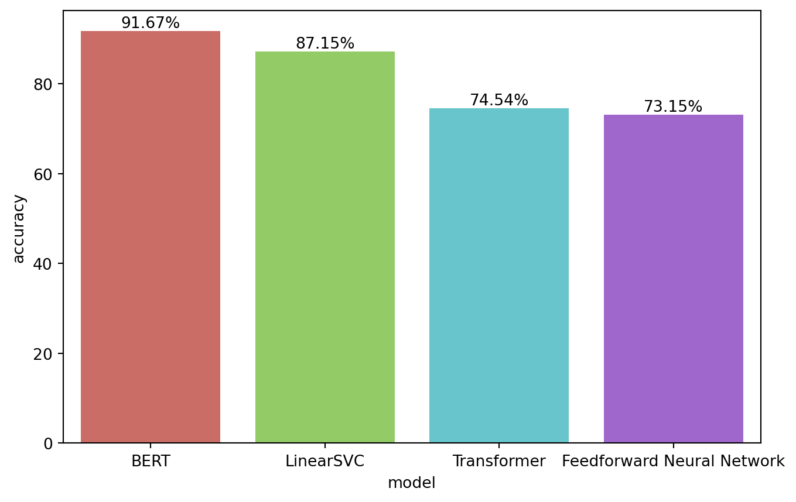

In this section of the project, I explored four different models for resume classification: Linear SVC, FNN, Transformer, and BERT. I evaluated the performance of each model using the accuracy metric and collected the results after each deployment. Below I plot the accuracy of each model and discuss the results.

``` python
import pandas as pd
import matplotlib.pyplot as plt
import seaborn as sns

df = pd.read_json('./output/classifier_performance.json').sort_values(by='accuracy', ascending=False)

ax = sns.barplot(df, x='model', y='accuracy', hue='model', palette='hls')
[ax.bar_label(container, fmt="%0.2f%%") for container in ax.containers]
plt.show()
```



All four models performed well in classifying resumes, achieving accuracies above 70%. This success can be largely attributed to the effectiveness of the data preparation process, including text preprocessing, data balancing, and robust vectorization techniques. These preprocessing steps provided the models with high-quality input features that significantly enhanced their performance.

Upon closer evaluation, the models can be grouped into two categories based on their performance. The first group, achieving around 90% accuracy, includes the Linear SVC and BERT models. The second group, with accuracies around 70%, includes the FNN and Transformer models. Interestingly, the two best-performing models feature both the simplest and most complex architectures respectively, while the models with the lowest performance have more complex architectures than the baseline model. I discuss the reasons behind these results below.

Linear SVC's high performance can be attributed its simplicity and the effective feature representation[^conc-1]. The model is a classical machine learning algorithm that uses a linear kernel and no deep learning, which yields a simple architecture that is easy to train. Additionally, the model was trained on TF-IDF vectors, which result in a matrix with simple, but interpretable and informative features. This simplicity reduces the risk of overfitting and the straightforward feature representation contributes to the model's high accuracy and fast training times.

In contrast, BERT's performance strems from its pre-trained nature and high-quality embeddings. The model was pre-trained on a large corpus and thus has the ability to generate embeddings that encode deep semantic information[^conc-2]. Moreover, its bidirectional nature captures a wide range of contextual information across a long-range dependencies. Its suitability for Transfer Learning allows maximizing its pre-trained weights and easily fine-tuning on resume classification task, resulting in the high accuracy achieved.

The FNN and Transformer models, despite their increased complexity, achieved lower accuracies of around 70%. The Feedforward Neural Network, while more advanced than a linear model, lacks the ability to capture sequential dependencies and contextual nuances in the data, thus expected to perform worse than the transformer models.

However, the Transformer model should have been able to capture the sequential dependencies in the resume data, given its state-of-the-art architecture and use of multi-head self-attention. But contrary to BERT, the Transformer used in this project was not pre-trained on a large corpus. This limited its ability to generate high-quality dense representations of the texts. Additionally, insufficient fine-tuning may have prevented the Transformer from reaching its full potential. Given the results of a similar, more complex model such as BERT, additional hyperparameter tuning and training time could improve its performance.

## Conclusion

In this project, I explored the task of resume classification using machine learning and deep learning models. The process began with preprocessing the resume data, including tokenizing the resumes and preparing them for model input. I implemented four models: a Linear Support Vector Classifier, a Feedforward Neural Network, a Transformer model, and a BERT model. These models were trained and evaluated on the resume dataset, with performance compared based on accuracy.

The results were very insightful and provoked interesting observations on the role of model complexity and feature representation in achieving high performance. The BERT model achieved the highest accuracy of 91.67%, closely followed by the LinearSVC model at 87.15%. The Feedforward Neural Network and Transformer models achieved lower accuracies of 73.15% and 74.54%, respectively. BERT's superior performance can be attributed to its pre-trained transformer architecture, which captures rich semantic relationships and dependencies within text sequences. The strong performance of the LinearSVC model can be attributed to its simplicity and efficiency in handling high-dimensional data, leveraging high-quality, interpretable feature representations such as TF-IDF vectors.

Two important observations arise from these results:

1.  **State-of-the-art transformer models, combined with transfer learning from pre-trained models like BERT, yield the best performance.**
2.  **Simple models with high-quality, interpretable feature representations such as TF-IDF vectors, can also achieve high performance.**

These contrasting observations indicate that model complexity alone does not guarantee high performance. This is further supported by the fact that the two models with the lowest accuracies have more complex architectures than the baseline. Instead, the quality of the feature representation and the ability to capture contextual information across dependencies are more important factors in achieving high performance.

Ultimately, the best model depends on the requirements of the task at hand and the resources available for development. For tasks where high performance is critical and ample resources are available, using state-of-the-art transformer models such as BERT with transfer learning are recommended. For tasks prioritizing simplicity and interpretability, Linear SVC with TF-IDF vectors still offers a high-performance, resource-efficient alternative.

[^conc-1]: To read more on the efficiency of linear classifiers in text classification, see [Lin, Y.-C. et al. (2023) 'Linear Classifier: An Often-Forgotten Baseline for Text Classification', in Proceedings of the 61st Annual Meeting of the Association for Computational Linguistics (Volume 2: Short Papers). Proceedings of the 61st Annual Meeting of the Association for Computational Linguistics (Volume 2: Short Papers), Toronto, Canada: Association for Computational Linguistics, pp. 1876--1888.](https://doi.org/10.18653/v1/2023.acl-short.160)

[^conc-2]: Devlin, J. et al. (2018) 'BERT: Pre-training of Deep Bidirectional Transformers for Language Understanding'. arXiv. Available at: https://doi.org/10.48550/ARXIV.1810.04805.

[^conc-3]: [RoBERTa](https://github.com/pytorch/fairseq/tree/main/examples/roberta): A Robustly Optimized BERT Pretraining Approach.

[^conc-4]: [GPT-3](https://openai.com/research/gpt-3): Language Models are Unsupervised Multitask Learners by OpenAI.

[^conc-5]: [T5](https://github.com/google-research/text-to-text-transfer-transformer): Exploring the Limits of Transfer Learning with a Unified Text-to-Text Transformer by Google Research.
